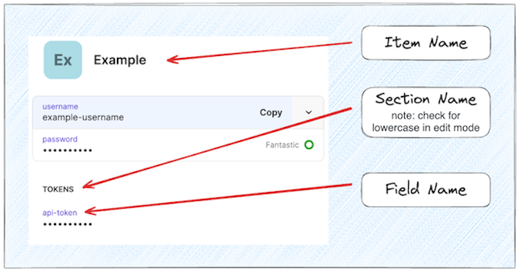

# Terraform Module - 1Password Read Value

This Terraform module retrieves the value for a specific field in a specific section of a 1Password item. This module addresses the challenge of parsing the JSON object returned by the provider directly.  It uses the 1Password provider to interact with the local 1Password App.

## Usage

To use this module, you need to provide the following variables:

- `vault_uuid`: The UUID of the 1Password vault.
- `item`: The name of the 1Password item containing the secret.
  - Must be unique; the 1password provider will error if there are multiple entries with this name in the Vault
- `section`: The section within the item where the secret is stored.
  - verify the exact section name by opening the item in edit view.
  - note: 1password UI displays section headings in all-CAPS, but the underlying value may contain lowercase.
- `field`: The field within the section where the secret is stored.

### Terraform Example

``` hcl
data "onepassword_vault" "vault" {
  name = "Personal"
}

module "onepass_read_value" {
  source = "github.com/robertpeteuil/terraform-onepassword-read-value?ref=main"

  vault_uuid = data.onepassword_vault.vault.uuid
  item       = "your-item-name"
  section    = "your-section-name"
  field      = "your-field-name"
}

output "secret_value" {
  value     = module.onepass_read_value.value
  sensitive = true
}
```

Replace `"your-item-name"`, `"your-section-name"`, and `"your-field-name"` with values from the UI as shown below.

After running `terraform apply`, the value of the specified field will be outputted as `secret_value`.

### UI to Variable Mapping



## Requirements

- Terraform >= 0.12
- 1Password Provider >= 1.4
- 1Password CLI >= 2.23.0
  - installed and configured to work with local 1Password App
  - installation guide: <https://developer.1password.com/docs/cli/>

## Providers

| Name | Version |
|------|---------|
| onepassword | ~> 1.4 |

## Inputs

| Name | Description | Type | Default | Required |
|------|-------------|------|---------|:--------:|
| vault_uuid | 1Password Vault UUID | string | n/a | yes |
| item | 1Password Item containing secret | string | n/a | yes |
| section | 1Password Section within Item | string | n/a | yes |
| field | 1Password Field within Section in Item | string | n/a | yes |

## Outputs

| Name | Description |
|------|-------------|
| value | The value of the specified field in the 1Password item |

Please review and let me know if you need any changes or additions.
